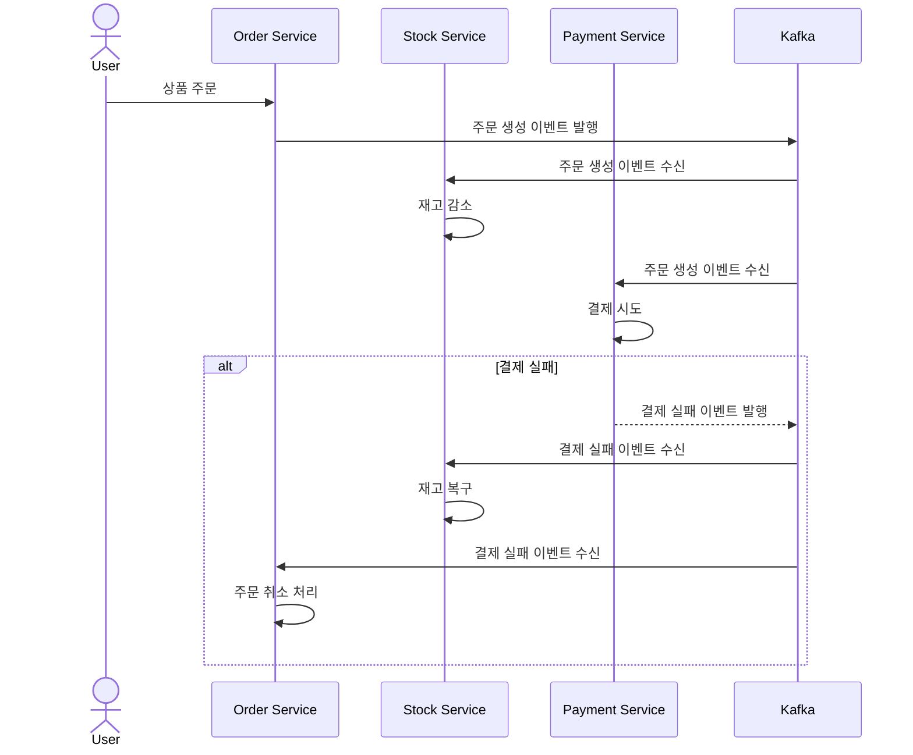

# Saga Pattern

#### 사용 기술

- Kotlin, Spring Boot, H2, JPA

#### 주요 기능

사용자는 상품을 주문할 수 있으며, 결제가 실패할 경우 해당 주문은 자동으로 취소됩니다. 이와 동시에, 해당 상품의 재고는 이전 상태로 복구됩니다.

 

## 프로젝트 상세

### Sequence Diagram

```mermaid
sequenceDiagram
    actor User as User
    participant OrderService as Order Service
    participant StockService as Stock Service
    participant PaymentService as Payment Service
    participant Kafka as Kafka
    User ->> OrderService: 상품 주문
    OrderService ->> Kafka: 주문 생성 이벤트 발행
    Kafka ->> StockService: 주문 생성 이벤트 수신
    StockService ->> StockService: 재고 감소
    Kafka ->> PaymentService: 주문 생성 이벤트 수신
    PaymentService ->> PaymentService: 결제 시도
    alt 결제 실패
        PaymentService -->> Kafka: 결제 실패 이벤트 발행
        Kafka ->> StockService: 결제 실패 이벤트 수신
        StockService ->> StockService: 재고 복구
        Kafka ->> OrderService: 결제 실패 이벤트 수신
        OrderService ->> OrderService: 주문 취소 처리
    end
```