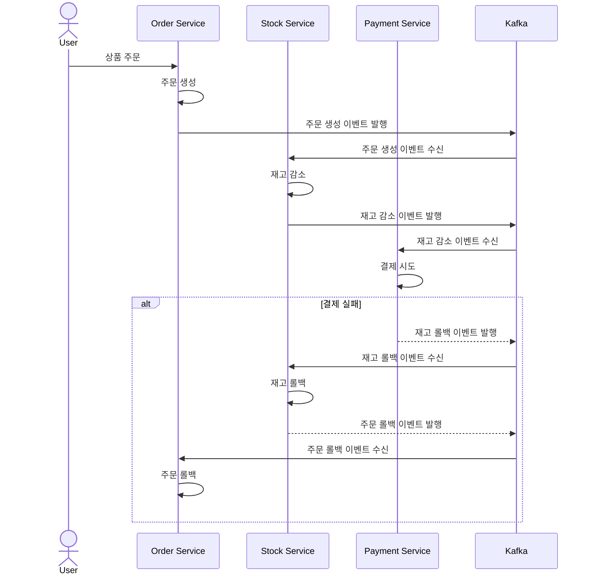

# Saga Pattern

이 프로젝트는 MSA(Microservices Architecture) 환경에서 트랜잭션 관리를 Saga 패턴을 사용하여 구현한 예제입니다. 패키지 구조는 Hexagonal Architecture로 구성되어 있으며, Kotlin을 사용하여 구현했습니다.

프로젝트의 주요 목표는 MSA 환경에서의 트랜잭션 관리 방식을 이해하고, Kotlin 언어를 활용하여 애플리케이션을 개발하는 것입니다. 또한, Hexagonal Architecture를 적용하여 유지보수성과 확장성 있는 코드 구조를 설계하는 것입니다.

#### 사용 기술

- Kotlin, Spring Boot, H2, JPA

#### 주요 기능

- 사용자는 상품을 주문할 수 있으며, 결제가 실패할 경우 해당 주문은 자동으로 취소됩니다. 이와 동시에, 해당 상품의 재고는 이전 상태로 복구됩니다.

 

## 프로젝트 상세

### 1. Saga Pattern

#### Choreography-based:

- 각 서비스가 이벤트를 통해 독립적으로 상호작용하며, 중앙 조정자 없이 분산된 형태로 동작합니다.

#### 보상 트랜잭션:

- 트랜잭션 실패 시 원래 상태로 되돌리기 위한 보상 트랜잭션을 사용합니다.

 

### 2. Hexagonal Architecture

각 구성 요소가 독립적으로 동작할 수 있도록 설계하여 코드의 응집도를 높이고 결합도를 낮췄습니다.

 

## Sequence Diagram

